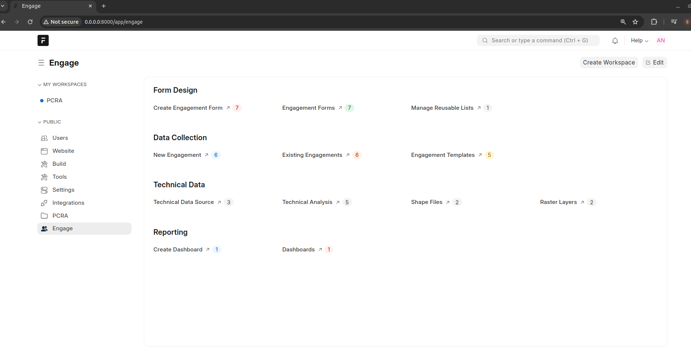

============================
Participatory Processes Tool
============================

This tool provides a platform to digitalize participatory processeses or any other process that requires interaction with stakeholders. The platform provides features that allow users to design **instruments**, commonly called **Forms**. The forms are the means through which data is captured. A **Form** contains what fields are stored for your data, and how they behave with respect to each other. It contains information about how your data is named.

A **Field** can also be referred to as a **variable or column**. A field represents an attribute of the form. For instance when collecting data about a household, several fields can be defined such as **Household Head Name, Household Size etc**

Architecture
============

- The platform is composed of a **Frontend** and the **Backend**
- The backend provides functionalities to users to enable them design participatory processes. It is also acts a repository for data and reports
- The frontend is an application that is installable on Android devices. The frontend consumes configurations defined on the backend and renders participatory instruments on user devices thus allowing data capture using devices

Backend
-------

This tool contains 3 main modules

**1. Participatory Process Designer**

- This module enables users to design participatory processes and the respective instruments supporting those processes
- Users also assign permissions to users who are authorized to view, capture or analyze data against a specific instrument
- Instruments created are referred to as **Engagement Forms**
- Users can also create **Engagement Templates** that outline the specific instruments to be deployed to an **Engagement** that uses that Engagement Template

**2. Technical Data Module**

- This module deals with ingestion of various technical data points and different analyses that can be performed against the data points. Examples of technical data can be County Statistics, Shape files and raster layers for geographic data
- Once a technical analysis has been defined, the same analysis will be available to the end users

**3. Dashboard and Reporting**

- This module is responsible for providing the means to generate analysis, reports and dashboards against data collected using Engagement Forms

Frontend
--------

- This is the tool that end users interact with for data capture for the engagement processes
- The frontend is fully reliant on the backend for optimal operation