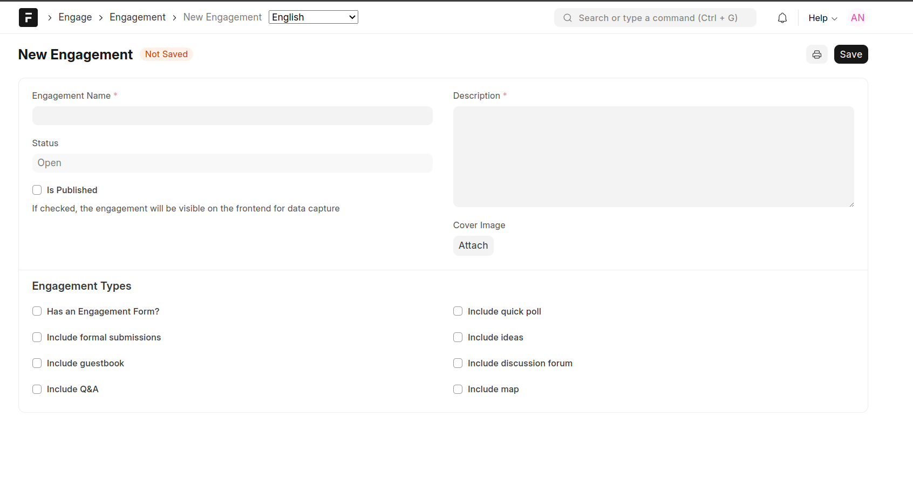

==========
Engagement
==========

An engagement is a means of deploying an engagement tool. Through an engagement, we can deploy an engagement tool for a period of time. If a tool does not have an associated engagement, it will not be possible to collect data using the tool

- **Engagement Name**. This is unique name given to an engagement, e.g Public Participation For Budget 2025/2026
- **Status**. The status of the engagement. Available options are Open and Closed. An engagement is open as long as the current date is earlier than the closing date
- **Is Published**. Publishing an engagement activates data collection against the associated engagement tool. Only published engagements will be visible in the frontend application
- **Closing Date**. This is the date until which data can be collected against the associated engagement tool.
- **Description**. The text provided here will be shown as introduction to a user who is capturing data using the associated engagement tool. Therefore make this as clear and concise as possible
- **Cover Image**. If an image is attached here, the same will be used as a thumbnail when displaying the list of engagements in the frontend application
- **Engagement Types**. This describes the type of engagement:
  
    - **Has an engagement form**. This type of engagement is one that uses a standard form to capture feedback
    - **Include Formal Submissions**. This type of engagement incorporates situations where documents are likely to be submitted. An example use case is when institutions and citizens are giving views on a proposed policy or budget proposals
    - **Include Guestbook**. This is an engagement that allows anonymous responses against a specific question or topic
    - **Include Q&A**. This type of engagement is one where questions can be asked and answers provided. This is similar to comment sections in social media platforms
    - **Include Poll**. This caters for situations where users are provided with an option to vote on one or more choices
    - **Include ideas**. This is a free form situation that allows users to submit random ideas
    - **Include discussion**. This is similar to ideas only that it allows users to give their responses against a specific topic
    - **Include map**. In this type of engagement, the users have an option to submit spatial data