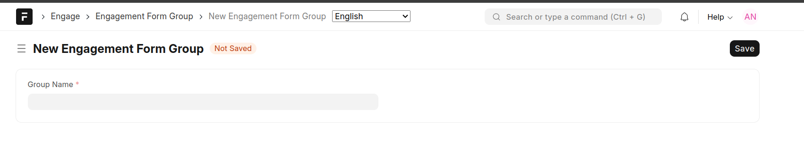
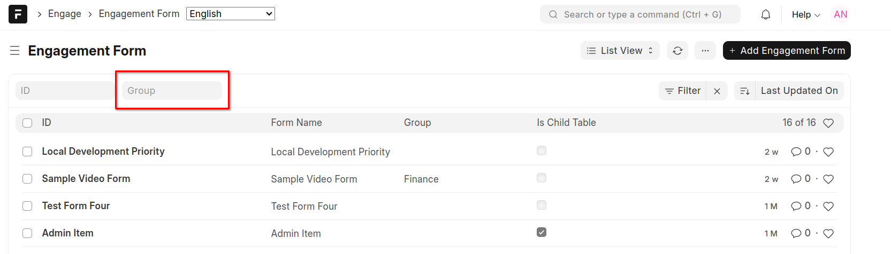

=====================
Engagement Tool Group
=====================

This feature provides a logical means of grouping engagement tools. For instance, different departments may want to group their tools under a single grouping for purposes of :doc:`permissions assignment <../setup/form-permissions>` and ease of access.

- Engagement tools will also be filtered by available groups thus providing a cleaner way to narrow down to tools grouped under specific groups

