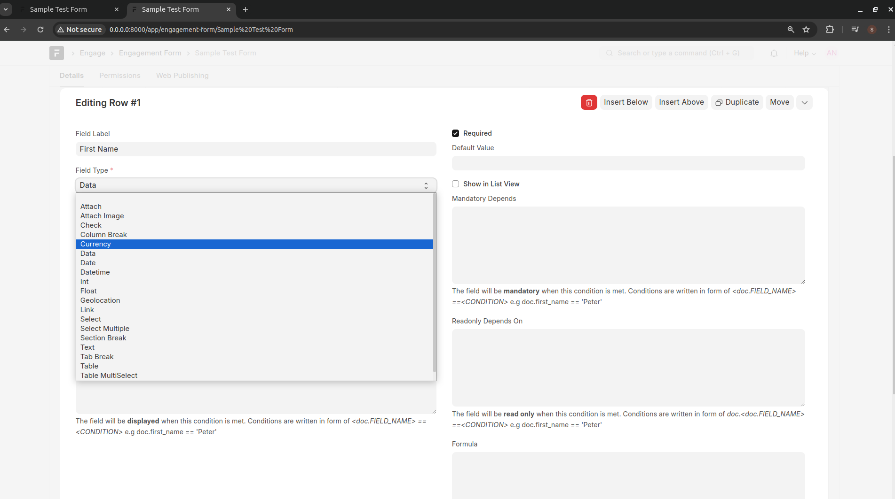
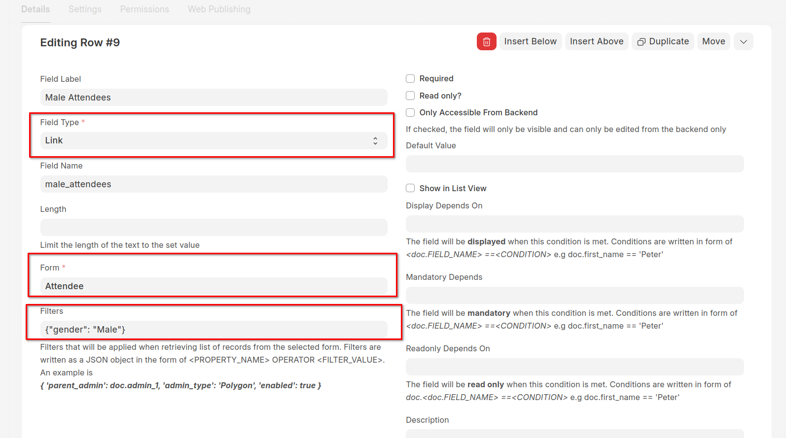
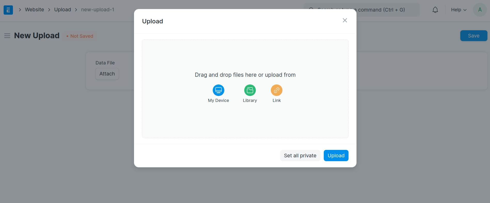
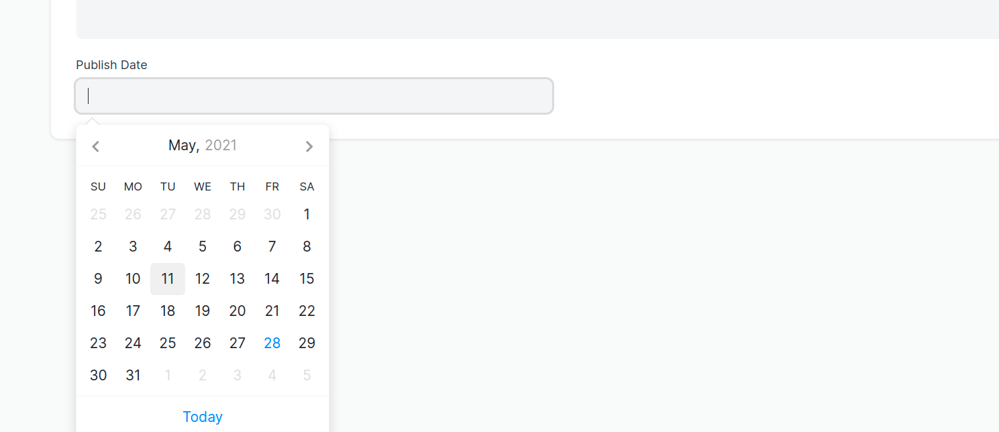
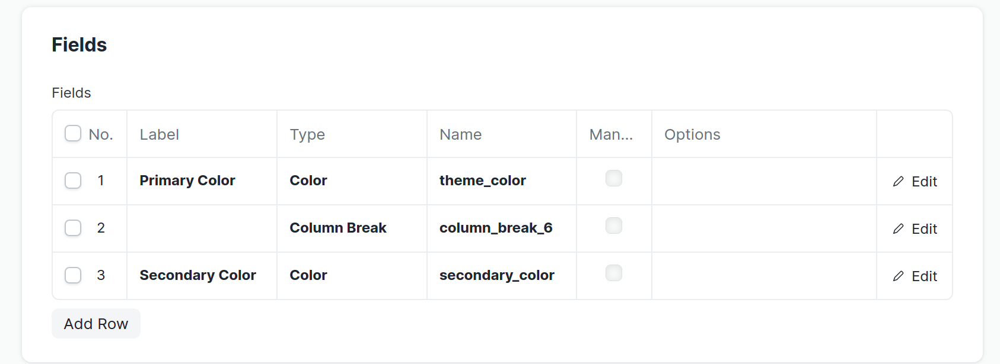
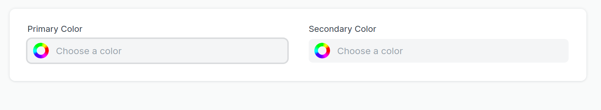
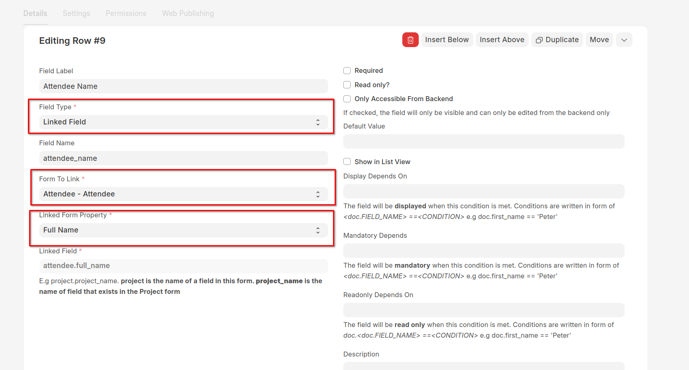
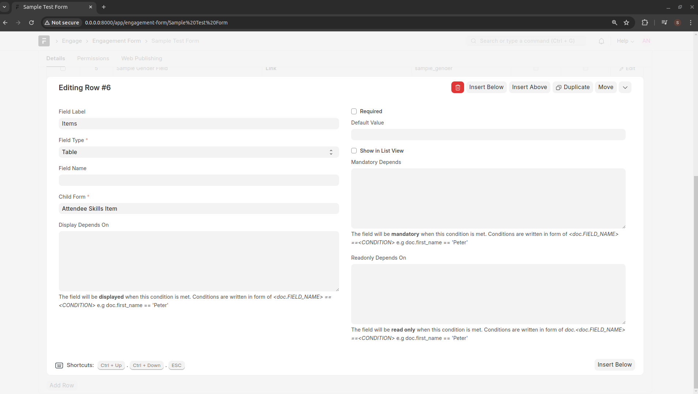

===========
Form Design
===========

To engage different stakeholders, an **Engagement Form** is required. An engagement form consists of different fields whose data must be captured. An engagement form provides a structured and organized way to capture data.

Field Types
-----------

There are variety of fieldtypes available in the backend. Each one has its own use case and can be used to input and store different types of data in a document. Fieldtypes are used to render components in backend, frontend as well as web forms.

**Data**

The data field will be a simple text field. It allows you to enter a value of up to 140 characters, making this the most generic field type. You can enable validations for the following types of data:

- Name
- Email
- Phone 

By setting the options to "Name", "Email" or "Phone" respectively.

**Link**

Link field is connected to another master (Engagement Form or Reusable List) from where it fetches data. For example, in the Household Form, the County is a Link field. A link references data that has multiple attributes and the data can change. An example is a list of Sub-counties and wards. It can be cumbersome to list sub-counties and wards for each form that uses these data points. In that case, you would define the sub-counties and wards once and then reuse the list by specifying a Link field.

You can specify the filters to be applied when retrieving values for a Link field. The filters are specified in form of a `JSON <https://www.w3schools.com/js/js_json_intro.asp/>`_ object. See examples below:

1. To select only male participants

.. code:: JSON

    { "gender": "Male" } 

or 

.. code:: JSON

    { "gender": ["=", "Male"] } 

2. To select a list of counties with population of more than 200000

.. code:: JSON

    { "population": [">", 2000000]" }

2. To select a list of attendees with Farming and Livestock Keeping as their livelihoods

.. code:: JSON

    { "livelihood": ["in", ["Farming", "Livestock Keeping"]]" }
    

Please note that you will need to replace the field names with the appropriate names as specified when designing the linked form.

**Check**

This will enable you to have a checkbox here. You can set the Default value to 1 and it will be checked by default.

**Select**

Using the field type "Select", you can create a drop-down field. You can specify all selectable values in the Options field, each value separated by a new line. One of the selectable values can be copied into the Default field. This value will then be selected by default in a new form. 

.. note::
    Use a Select field when you have standard options that are few in number and that are unlikely to ever change

**Attach**

Attach field allows you to browse a field from the File Manager and attach the same herein.

**Date**

This field will enable you to enter the Date in this field.

**DateTime**

This field will give you a date and time picker. The current date and time (as provided by your computer) are set by default.

**Column Break**

This is a 'meta' fieldtype that does not store any input data but can be used to indicate a column break in the document view or form.

For example,

will result into

**Currency**

Currency field holds numeric value, like Item Price, Amount, etc. Currency field can have value up to six decimal places. Also, you can have a currency symbol being shown for the currency field.

**Float** 

Float field carries numeric value, up to nine decimal places.

**Geolocation**

A Geolocation field will show a map view on which you can draw polygons, lines, and points. The data is stored as a GeoJSON feature_collection.

**Int (Integer)**

The integer field holds numeric value, without decimal place.

**Text**

Text field carries text content and has more character limit than the Data field.
 
**Table MultiSelect**

This is a combination of 'Link' type and 'Table' type fields. Instead of a child table with 'Add Row' button, in one field multiple values can be selected.

**Time**

This is a Time field where you can define the Time in the field.

**Linked Field**

This is a field that derives its value from a property of another form that is being referenced in the current form. For example say you want to display the full name of a person after selecting their id number. In this example, you will have to first add a Link field that gets its data from the Person form. Then, you will add a Linked Field that then you specify the value of _Form To Link_ to be the _Person_ field. The value of _Linked Form Property_ will be set as the full name property of the Person form

Child / Table Form
------------------
There might be a need for storing multiple records against one record, also known as many-to-one relationships. A Child Form is form which can only be linked to a parent Engagement Form. To make a Child form make sure to check Is Child Table while creating the Engagement Form. To link a Child form to its parent, add another row in Parent Engagement Form with field type **Table** and set the value of the Child Form as the name of the Child Table you just created.

Conventions
-----------
To enable rapid application development, the Backend follows some standard conventions.

- Engagement Form is always named in singular. If you want to store a list of households in the database, you should name the Engagement Form as **Household**
- The name of the Engagement Form cannot be more than 61 characters
- The labels are always named such that the first letter of each word is in upper case and all other letters are in lower case, e.g **First Name**
- When assigning field names, use **Snake Case** naming convention. Snake case separates each word with an underscore character (_). When using snake case, all letters need to be lowercase e.g **first_name**. Snake case is used for creating variable and field names.
