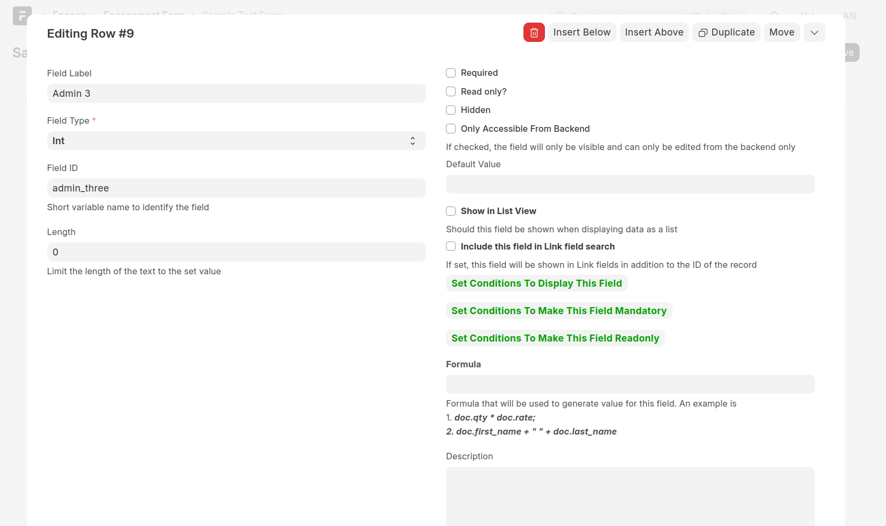

==========
Form Field
==========

Form Fields are the building blocks of an Engagement Form. Each Form Field has the following attributes

**Field Label**
This specifies the descriptive text that will be displayed to the user to explain to them the data being captured by that field. Make sure that the field labels are as self-explanatory as possible. As a convention, the labels are always named such that the first letter of each word is in upper case and all other letters are in lower case, e.g **First Name**

**Field Type**
This defines the type of data being stored by the field. Several field types exists such as integers, date, currency etc. See :ref:`Field Types <form-design>`

**Field Name**
This is the name that will be assigned to a column in the table storing the form records in the database. The following conventions are followed when defining the field name:
    
    - Only lowercase characters are allowed
    - The name must begin with a letter
    - Special characters are not allowed such as %, =, ], >, < etc
    - Underscores are allowed and can be used to make the name more readable such as **first_name** instead of **firstname**
    - The length of the name cannot be more that 61 characters

**Length**
This value limits the length of the values entered for the field. Such as, you can define that the country codes must not exceed a length of 3

**Display Depends On**
This property determines whether the field will be displayed or not. A condition that will be evaluated has to be specified e.g

.. code-block:: javascript

    doc.first_name == 'Peter'

In the above example, this field will only be displayed when the value of first_name field has been set as Peter.
This property is used to implement skip logic by defining the conditions which determine if a certain field will be displayed or not

**Readonly Depends On**
If this condition is satisfied, the field will be read only

**Readonly Depends On**
If this condition is satisfied, the field will be mandatory
 
**Required**
If this is checked, the field will be mandatory

**Default Value**
Is specified, this will be the default value for the field

**Show in List View**
If checked, this field will be visible when displaying the records in List View

.. image:: ../_static/images/list-view.png
    :align: center
    :alt: List view

**Formula**
The formula that will be used to generate value for this field. An example is

.. code-block:: javascript

    doc.first_name + " " + doc.last_name
    doc.qty * doc.rate