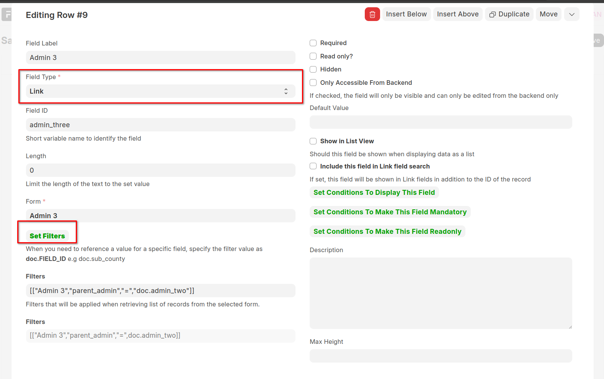
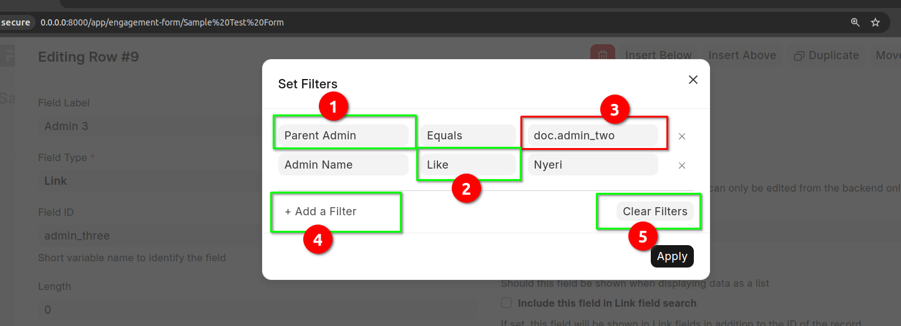

====================
Dynamic Link Filters
====================

Sometimes, the value of a link will depend on a value of another field. For example, you may want to filter Admin level records based on the value of a higher admin level. An example is when you want to select all wards that belong to a specific county. A ward and a county will have a parent-child relationship which makes it possible to perform cascaded Filters.

- To set filters for an engagement form field, click on the **Set Filters** button which is only available when the field type is of type **Link**

- To add a filter, click on the button labeled 4.
- To specify the field you want to filter with, click on the dropdown labeled 1. Here you will have a list of all the available fields. Select the field that you wish
- To specify the operand, select the dropdown labeled 2. There are different operands depending on the type of field selected
- Click on the area labeled 3 to specify the filter value. 

.. note:: 

    If you want to specify the filter value as the value of a field of the current record, in the area labeled 3, type the value as **doc.{FIELD_ID}**. Remember to replace **{FIELD_ID** with the actual id of the field e.g **doc.admin_two**

- Click on Clear Filters button to set the filters
- Once you have set the filters click on the Apply button