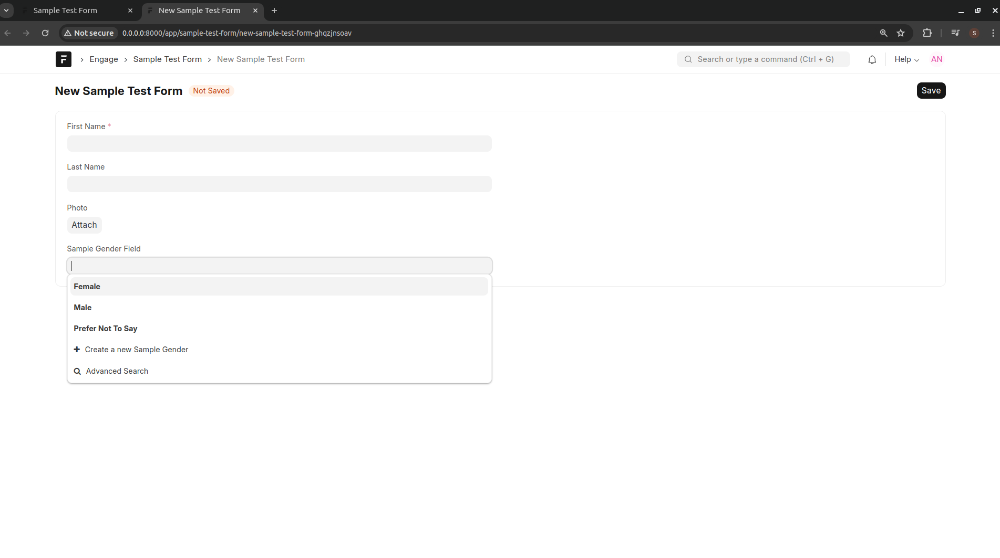

==============
Reusable Lists
==============

There is need to provide an interface where standard institutional lists are managed from the backend. This will eliminate duplication of standard lists and thus ensure that forms make use of uniform lists. For example, Gender has standard options and there is need to ensure that all forms making use of the Gender reference the same options.

There is an option to assign different permissions to different user roles. For example, Climate Change Department can be in-charge of maintaining list of hazards, while the planning department can be in-charge of maintaining the list of projects.

Create a Reusable List
----------------------

- Open Reusable List interface

- Create a new Reusable List 

- You can add/edit/delete list items at any time
- Note that you will receive an error message when you attempt to delete a list item that has already been used by another form

.. note:: 

    You can determine the order in which list items will be ordered when the list is in use within an engagement tool. This can be done by specifying the field to sort by and the direction. The directions are ASC (ascending) and DESC (descending)

Import Reusable List
--------------------

When designing an Engagement Form, create a field of type **Link** and select the Reusable Link from the **Form** field

Reusable List in Data Capture
-----------------------------

- List items added as part of a reusable list will appear as options when capturing data on the frontend

