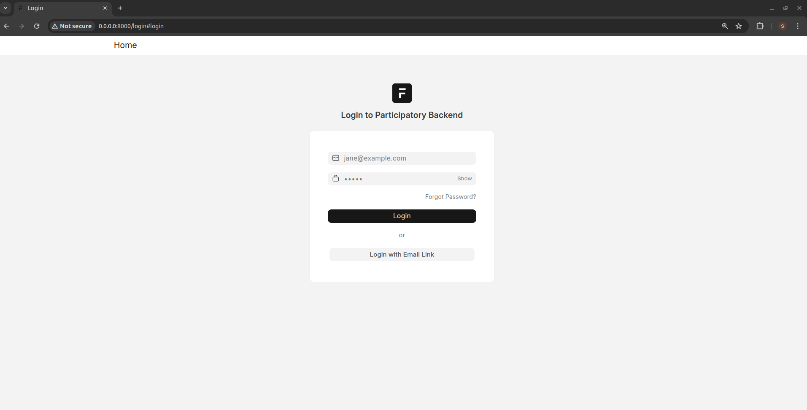
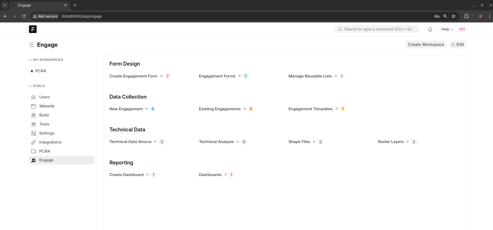

Installation
============

Backend installation
--------------------

Pre-requisites
**************

Install the following before proceeding

1. Install docker
See `Docker installation <https://docs.docker.com/engine/install/ubuntu/>` 

1. Install docker-compose

.. code-block:: bash

    sudo apt install docker-compose

1. Install git

.. code-block:: bash

    sudo apt install git

1. Clone the backend repository

.. code-block:: bash

    git clone -b main --depth 1 https://github.com/e3tools/participatory-backend.git participatory_backend

1. Installation via Docker

.. code-block:: bash

    cd participatory_backend
    docker compose -f docker-compose.yml up -d --build

Wait for about 5 minutes and then open a browser and type http://<SERVER_IP>. You should see a login screen

- Enter the following credentials:

    - Username: *admin*
    - Password: *admin*

- After logging in, click the Engage link on the left side of the menu to load the following page

