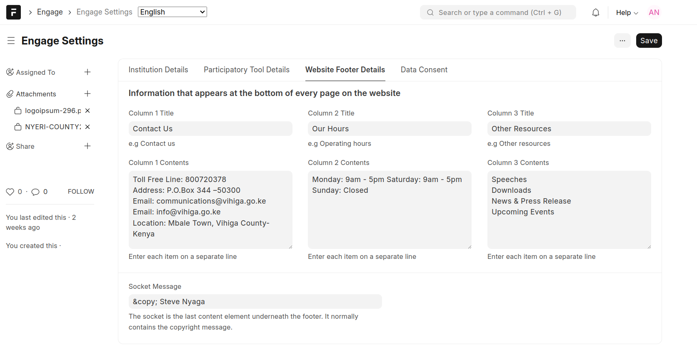

===============
Engage Settings
===============

This form supports one-time setup of values used by both the backend and the frontend. 

- Institutional details

.. image:: ../_static/images/engage-settings-1.png
    :align: center
    :alt: Engage Settings 1

- Participatory tool details

.. image:: ../_static/images/engage-settings-2.png
    :align: center
    :alt: Engage Settings 2

- Website footer details

- Data Consent. This interface allows creation of terms and conditions that the user has to accept when consenting for usage of their data

