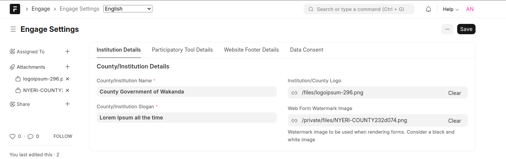
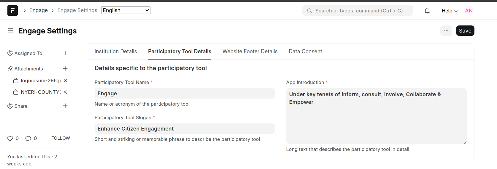

===============
Engage Settings
===============

This form supports one-time setup of values used by both the backend and the frontend. 

- Institutional details

- Participatory tool details

- Website footer details

- Data Consent. This interface allows creation of terms and conditions that the user has to accept when consenting for usage of their data

