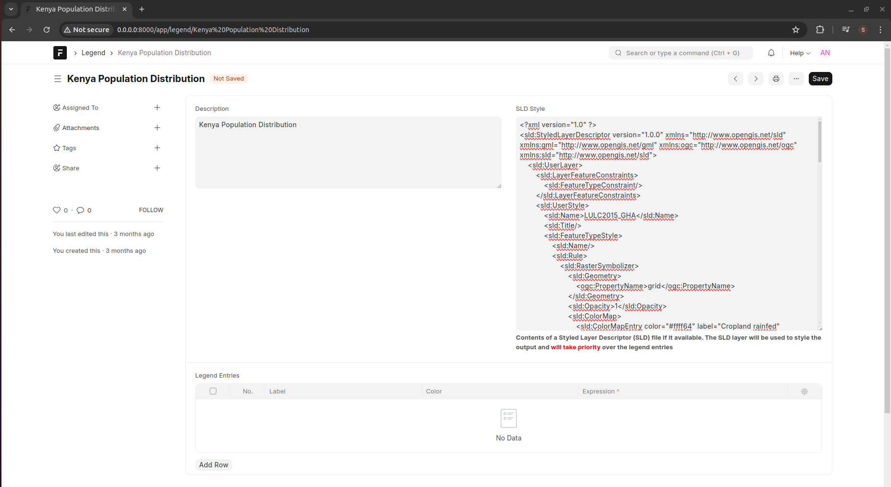

======
Legend
======

A legend displays the meaning of the symbols, colors and styles used to represent geographic data on the map. Legends consist of examples of the symbols on the map with labels containing explanatory text. Legends have patches that show examples of the map symbols. Often, legend patches are points, straight lines, rectangles, or color ramps that match the map symbols. The layer author may have customized the legend patches; for example, some areas are represented with patches of another shape, or rivers are drawn with a sinuous rather than a straight line.

To create a Legend, go to Engage -> Legend -> New Legend

 
- **Description**: A brief description of what the Legend is about
- **SLD Style**. A Styled Layer Descriptor (SLD) is an XML schema specified by the Open Geospatial Consortium (OGC) for describing the appearance of map layers. It is capable of describing the rendering of vector and raster data. A typical use of SLDs is to instruct a Web Map Service (WMS) how to render a specific layer. The Styled Layer Descriptor (SLD) standard allows for the application of style properties to the geographic features of a web map and also allows the retrieval of the web map style legend. The following points offer a more detailed description and definition of the SLD standard:

    - In order to visualize geospatial data it must be styled. Styled Layer Descriptors specify how feature types and layers are portrayed or rendered in WMS, WFS and WCS and are necessary to portray geospatial data of varying attributes
    - An XML schema, as defined by the OGC, can be implemented for describing the appearance of map layers (vector or raster) where an SLD document specifies a single named layer and a style for it
    - Each feature type style can have multiple rules as defined by an SLD document, which act as filters controlling how styling is applied based on features’ attributes and zoom level and contain symbolizers specifying styling for points, lines, polygons, raster data and text labels

- **Legend Entries**. This is a manual entry of how to style a raster or vector layer. 

If both the values of SLD and Legend Entries are specified, the SLD layer will be used to style the output and will take priority over the legend entries
