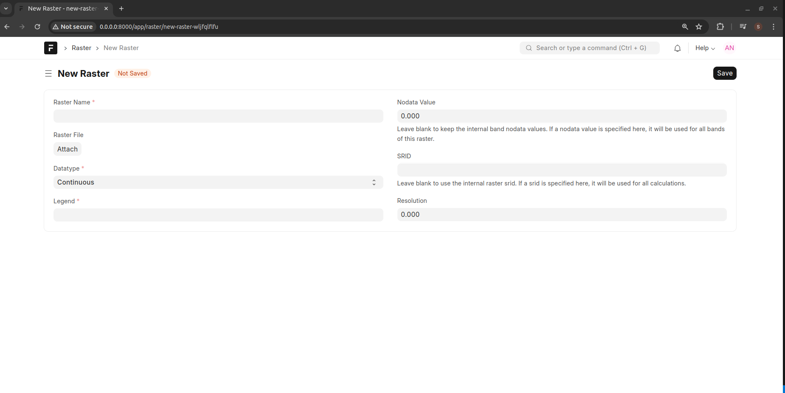
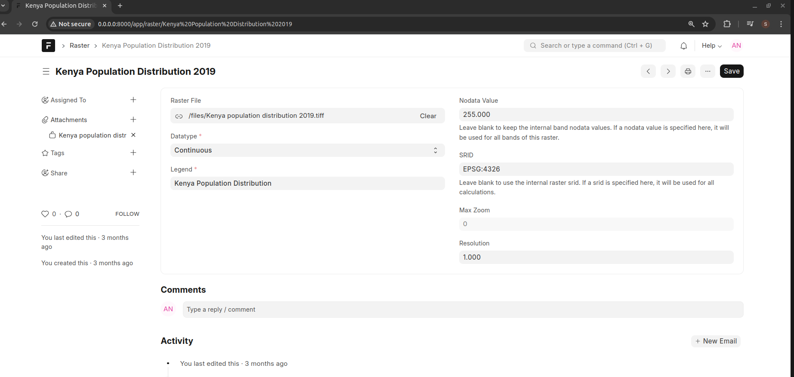

======
Raster
======

See :doc:`Technical Analysis <technical-analysis>` for details on what a Raster File is

To create a Shape File, go to Engage -> Raster -> New Raster

- *Raster*: The name to call the Raster File 
- *Raster File*. Attach a .tiff file 
- *Datatype*. Whether the pixel values are discrete or continuous
- *Legend*. This is a link to a Legend record which defines how to interprete values of pixels. See :doc:`Legend <legend>`
- *Nodata value*. The value of pixels that will be considered as having no data. NoData means that there is not enough information is known about a pixel cell location to assign it a value. Nodata represents missing or invalid data in a raster grid. Leave this field blank to keep the internal raster band nodata values. If a nodata value is specified here, it will be used for all bands of this raster
- *SRID*. Every geometric shape has a spatial reference system associated with it, and each such reference system has a Spatial Reference System ID (SRID). The SRID is used to tell which spatial reference system will be used to interpret each spatial object. A spatial reference identifier (SRID) is a unique identifier associated with a specific coordinate system, tolerance, and resolution.
- *Resolution*- Resolution in the spatial domain refers to the size of the smallest measurement unit observed or recorded for an object, such as pixels in a remote sensing image or line segments used to record a curve.

Example of an existing Raster Layer

