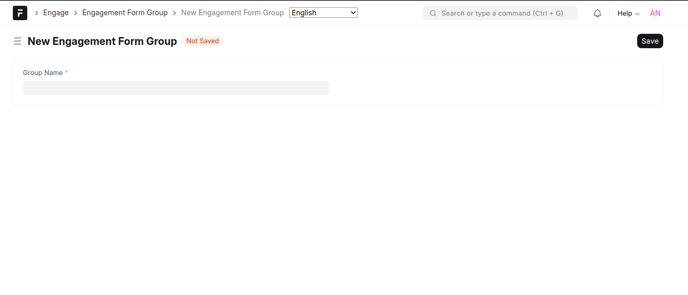

=========
Shapefile
=========

See :doc:`Technical Analysis <technical-analysis>` for details on what a Shape File is and the various files that are required

To create a Shape File, go to Engage -> Shape Files -> New Shape File

- *Shape File Title*: The name to call the Shape File
- *Description*: A brief description of what the Shape File is
- *Zip File*. Attach a Zip file containing .shp, .dbf, .shx and other related files. See :doc:`Technical Analysis <technical-analysis>` for a list of mandatory files
- *Geom*. This is a read only field that will present in a geographical manner, the contents of the uploaded zip file

When the zip file is uploaded, the system will parse the contents of the shape files and will display the contents under *Field Mappings* and *Entries* fields. In addition, the different vectors will be displayed in the *Geom* field.

**Field Mappings**

The field mappings field holds a mapping of the source shape file attribute and the database field that is storing the attribute value.

**Entries**

The entries field lists the different vectors (shapes) that are stored by the uploaded shape file. Each entry shows the attributes and geometry of each of the shapes.

