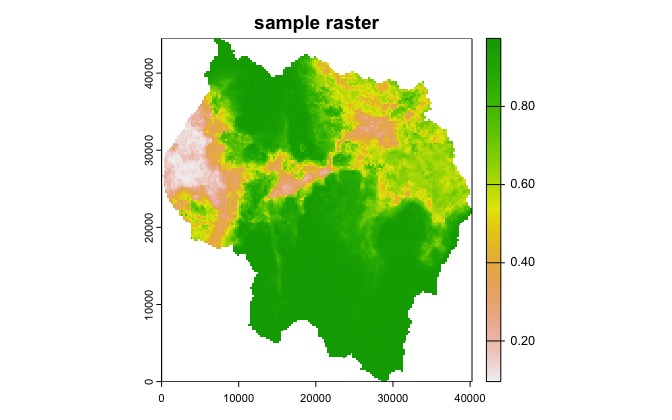
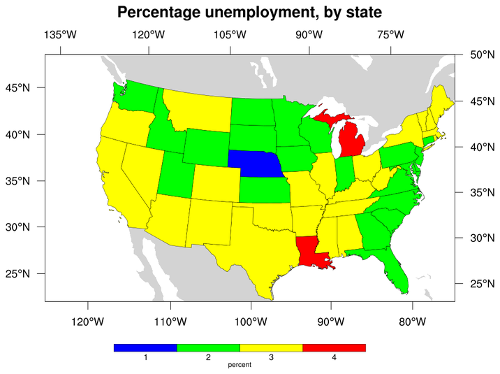
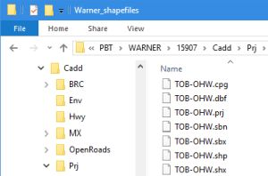
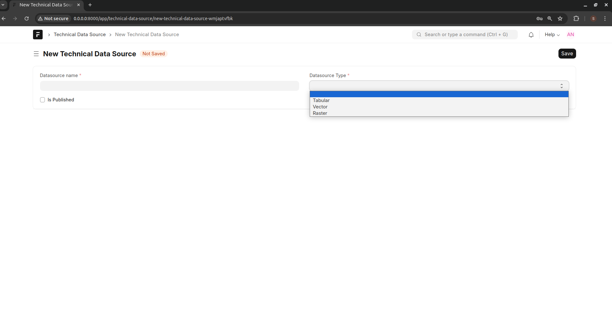

=====================
Technical Data Source
=====================

Technical data can be imported from different sources. These are:

- Raster layers
- shape files
- Tabular data

**1. Raster Layers**
--------------------
A raster layer is a type of data that consists of pixels — images, masks, paintings, and photos - so when you paint or edit images, you're working with raster layers. In its simplest form, a raster consists of a matrix of cells (or pixels) organized into rows and columns (or a grid) where each cell contains a value representing information, such as temperature. Rasters are digital aerial photographs, imagery from satellites, digital pictures, or even scanned maps.

Data stored in a raster format represents real-world phenomena:

- Thematic data (also known as discrete) represents features such as land-use or soils data.
- Continuous data represents phenomena such as temperature, elevation, or spectral data such as satellite images and aerial photographs.
- Pictures include scanned maps or drawings and building photographs.

Thematic and continuous rasters may be displayed as data layers along with other geographic data on your map but are often used as the source data for spatial analysis with the ArcGIS Spatial Analyst extension. Picture rasters are often used as attributes in tables—they can be displayed with your geographic data and are used to convey additional information about map features.

See :ref:`Raster Layers <raster>`

**2. Shape Files**
------------------

A shapefile is a simple, nontopological format for storing the geometric location and attribute information of geographic features. Geographic features in a shapefile can be represented by points, lines, or polygons (areas). The workspace containing shapefiles may also contain dBASE tables, which can store additional attributes that can be joined to a shapefile's features. 

The shapefile format is a digital vector storage format for storing geographic location and associated attribute information. The shapefile format stores the geometry as primitive geometric shapes like points, lines, and polygons. These shapes, together with data attributes that are linked to each shape, create the representation of the geographic data. The term "shapefile" is quite common, but the format consists of a collection of files with a common filename prefix, stored in the same directory. The three mandatory files have filename extensions .shp, .shx, and .dbf. The actual shapefile relates specifically to the .shp file, but alone is incomplete for distribution as the other supporting files are required. 

**Mandatory files**

- .shp — shape format; the feature geometry itself {content-type: x-gis/x-shapefile}. The .shp contains the geometry data. Geometry of a given feature is stored as a set of vector coordinates
- .shx — shape index format; a positional index of the feature geometry to allow seeking forwards and backwards quickly {content-type: x-gis/x-shapefile}. The index contains positional index of the feature geometry 
- .dbf — attribute format; columnar attributes for each shape, in dBase IV format {content-type: application/octet-stream OR text/plain}. This file stores the attributes for each shape

**Other files**

- .prj — projection description, using a well-known text representation of coordinate reference systems {content-type: text/plain OR application/text}
- .sbn and .sbx — a spatial index of the features {content-type: x-gis/x-shapefile}
- .fbn and .fbx — a spatial index of the features that are read-only {content-type: x-gis/x-shapefile}
- .ain and .aih — an attribute index of the active fields in a table {content-type: x-gis/x-shapefile}
- .ixs — a geocoding index for read-write datasets {content-type: x-gis/x-shapefile}
- .mxs — a geocoding index for read-write datasets (ODB format) {content-type: x-gis/x-shapefile}
- .atx — an attribute index for the .dbf file in the form of shapefile.columnname.atx (ArcGIS 8 and later) {content-type: x-gis/x-shapefile }
- .shp.xml — geospatial metadata in XML format, such as ISO 19115 or other XML schema {content-type: application/fgdc+xml}
- .cpg — used to specify the code page (only for .dbf) for identifying the character encoding to be used {content-type: text/plain OR x-gis/x-shapefile }
- .qix — an alternative quadtree spatial index used by MapServer and GDAL/OGR software {content-type: x-gis/x-shapefile}

In each of the .shp, .shx, and .dbf files, the shapes in each file correspond to each other in sequence (i.e., the first record in the .shp file corresponds to the first record in the .shx and .dbf files, etc.). The .shp and .shx files have various fields with different endianness, so an implementer of the file formats must be very careful to respect the endianness of each field and treat it properly.

See :ref:`Shape File <shapefile>`

**2. Tabular Data**
-------------------

Tabular data represents data that is represented as spreadsheets. Examples of such data is census data, population and other data such as those represented in county statistical abstract

**Define a Technical Data Source**

To create a Technical Data Source, Go to Engage -> Technical Data Source

- Give a descriptive name to the data source
- Checking the *Is Published* makes the data source available for defining technical analyses
- Specify the type of data source. You will need to have defined the respective Raster, Shape File or Tabular Data items before creating a data source. See :ref:`Raster Layers <raster>` and :ref:`Shape File <shapefile>`

